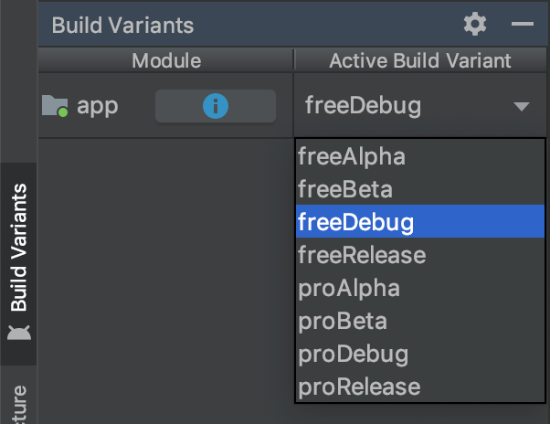
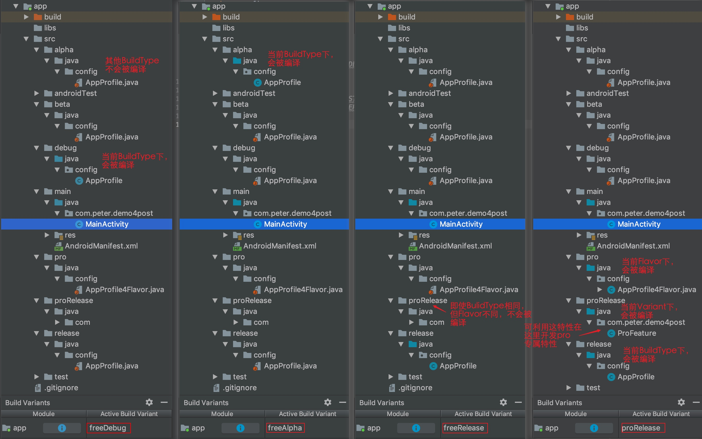

将环境配置与对应buildType关联，实现切换环境打包无需调整代码，保证各环境下必要的差异同时最大限度降低误、漏操作导致不应该的配置发布到应用市场。同时也简单整理了build.gradle相关配置，包含buildTypes、productFlavors、matchingFallbacks等。

## 1 背景

通常基于这些原因，我们需要为开发、测试、体验、生产等各个阶段环境定制专用配置：

* 将开发、测试、验收阶段的App与生产应用市场的App环境隔离
* 既要充分保障生产安全配置（日志控制、调试关闭、代码混淆、加固配置）、渠道差异配置，又要为开发、调试阶段提供足够信息、功能以高效输出
* 非生产阶段通常需要支持x86架构的模拟器，而出于安全保障，生产环境通常关闭
* 生产环境需要输出不能功能特性安装包，如免费版、付费版

这里把开发、测试、体验、生产四个环境依次定义为：debug、alpha、beta、release。

曾经的我们，将这些专用环境配置定义于xml、常量管理类等位置，每次在切换环境打包前，修改获取环境配置的指向方法，然后打包输出

曾经的我们，因修改环境获取指向不全，经历过类似这些教训：

* 未关闭在线调试的包投放到市场
* 未关闭调试模式而使投放到市场的APP未关闭debug级别日志
* App依赖的个别边沿模块甚至连接着测试服务器的包被投放到市场

其实Android Studio、Gradle早就考虑到了我们的这些需求，提供了通过buildTypes和productFlavors组合的Build Variants充分满足了我们以上定制需求。本文即记录了我们使用buildTypes和productFlavors实现Android环境配置自动切换的方法。

## 2 相关概念

**buildTypes**：构建类型，Android Studio的Gradle组件默认提供给了“debug”“release”两个默认配置，此处用于配置是否需要混淆、是否可调试等，我们的应用主要就依赖buildTypes完成各环境定义及关键配置指向

**productFlavors**：产品渠道，默认不提供任何默认配置，在实际发布中，根据不同渠道，我们可能需要动态切换不同的包名、动态替换AndroidManifest.xml中各种占位符等

**Build Variants**：构建变种，Android Studio的Gradle组件自动根据buildTypes、productFlavors配置，进行全部组合，分别生成一套构建、安装卸载相关的gradle tasks，可以在终端打印task清单看到这些task：

```
sh gradlew task
```

每一个buildTypes与productFlavors的组合称为一个variant（变种），我们通过执行指定variant的构建task，来指定输出目标variant apk等操作。在Android Studio “View->Tool Windows->Build Variants”可以看到如下情况。



## 3 配置实现

### 3.1 在buildTypes定义环境

在application module级别的build.gradle的buildTypes定义环境，在各环境配置好合适的混淆配置、签名、调试开关、ndk等。

这里建议从最严格的生产环境开始配置，其他环境使用上一个环境初始化基础上再调整，以免将不合适的配置投放到应用市场。

```groovy
android{
    buildTypes {
        release { //生产环境
            // 混淆文件的位置
            minifyEnabled true //开启删除无用代码，比如没有引用到的代码
            shrinkResources true //开启删除无用资源，也就是没有被引用的文件，和minifyEnabled配合使用
            signingConfig signingConfigs.origeial
            proguardFiles getDefaultProguardFile('proguard-android.txt'), 'proguard-project.txt'

            //一些调试开关配置
            debuggable false
            jniDebuggable false
            renderscriptDebuggable false
            pseudoLocalesEnabled false

            //对构建好的apk进行对齐操作，可优化安装时内存消耗，如没配置，也可以后续使用android sdk中的zipalign进行对齐
            zipAlignEnabled true

            // 如官文所述，根据配置的顺序在各依赖module对应的buildType进行依赖：
            // Specifies a sorted list of fallback build types that the
            // plugin should try to use when a dependency does not include a
            // "alpha" build type. You may specify as many fallbacks as you
            // like, and the plugin selects the first build type that's
            // available in the dependency.
            matchingFallbacks = ['release', 'qa', 'debug']

            // 去掉不必要的指令集，可有效减少包体积，未被包含的，即使你在该指令集项目目录放置了.so，也不会被打进apk中
            ndk {
                abiFilters "armeabi", "armeabi-v7a", "arm64-v8a"
            }
        }
        beta { //第二轮回归测试，生产体验环境
            initWith release

            //为方便跟踪，非生产环境调试开关都打开
            debuggable true
            jniDebuggable true
            renderscriptDebuggable true

            matchingFallbacks = ['debug', 'qa', 'release']

            // 非生产环境增加x86，以便在模拟器运行
            ndk {
                abiFilters "armeabi", "armeabi-v7a", "arm64-v8a", "x86"
            }
        }
        alpha { //日常模块测试、集成测试、第一轮回归测试
            initWith beta
        }
        debug { //开发调试
            initWith alpha

            // 开发调试关闭混淆，方便在线调试
            minifyEnabled false
            shrinkResources false
            signingConfig signingConfigs.customized_key

            //根据需要在对应环境添加包名后缀
            //applicationIdSuffix ".test"
        }

    }
}
```

### 3.2 在productFlavors定义渠道差异配置

在productFlavors定义渠道差异配置，比如动态切换不同的包名、动态替换AndroidManifest.xml中各种占位符等。

```groovy
android{
    // see https://d.android.com/r/tools/flavorDimensions-missing-error-message.html
    flavorDimensions "demo4post"

    productFlavors {
        //默认配置
        pro {
            //dimension "demo4post"
            //也可以在具体的flavor进行ndk指令集配置
            // ndk {
            //     //设置支持的SO库架构，开发环境增加x86支持，以在模拟器使用
            //     abiFilters "armeabi", "armeabi-v7a", "arm64-v8a", "x86"
            // }
        }

        free {
            //dimension "demo4post"
        }

        //针对具体渠道指定配置，如友盟分享的key还是只能通过manifest指定的占位符差异配置、app名、logo、功能特性等
        def umengAppKey, applicationName
        productFlavors.all { flavor ->
            if ("defaultFlavor" == name) {
                umengAppKey = "xxxxxxxxxxxxxxxxxxxx"
            } else {
                umengAppKey = "xxxxxxxxxxxxxxxxxxxx"
            }
            //修改用于系统应用管理、应用市场显示的名称
            if ("pdcxywzcx" == name) {
                applicationName = "应用名1"
            } else {
                applicationName = "应用名2"
            }
            flavor.manifestPlaceholders = [APPLICATION_NAME : applicationName, UMENG_APP_KEY: umengAppKey]
        }
    }
}
```

### 3.3 在src目录定义各环境指向配置

Android Studio支持在指定Variant下，编译main下java、res等目录自动同时编译生效与当前Variant相关的buildTypes、productFlavors名或者两者组合名目录下java、res等目录，具体效果如下图。



利用Android Studio这一特性，结合前面我们定义的四个环境debug、alpha、beta、release，我们可分别按BuildType定义目录，并在java目录编写config.AppProfile.java，进行环境配置，比如我们将非生产的其他三个环境debug、alpha、beta，配置config.AppProfile.java：

```java
public class AppProfile {
    /** 调试开关，生产环境要关掉 */
    public static final boolean IS_DEBUG = true;
    /** 严苛模式开关，生产环境要关掉 */
    public static final boolean IS_STRICT_MODE = true;
    /** 服务请求地址 */
    public static final String SERVER_URL = "https://xxx_test.xx.com";
}
```

在生产环境release，配置config.AppProfile.java：

```java
public class AppProfile {
    /** 调试开关，生产环境要关掉 */
    public static final boolean IS_DEBUG = false;
    /** 严苛模式开关，生产环境要关掉 */
    public static final boolean IS_STRICT_MODE = false;
    /** 服务请求地址 */
    public static final String SERVER_URL = "https://xxx.xx.com";
}
```

每一个特定的apk的Variant是固定的，因此，Android Studio会为我们准确选择对应我们所期望的配置进行编译，从而只要我们选对了BuildType输出的apk，环境配置即不会出错。结合CI/CD，即可实现自动切换配置的目的。

业务开发时引用这些配置做好合适逻辑适配即可，比如，对于日志控制，定义LogUtil.java如下：

```java
import config.AppProfile;
public class LogUtils {
    public static void d(String tag, String text) {
        if (AppProfile.IS_DEBUG) {
            Log.d(tag, text);
        }
    }
}
```

在打印日志时即可无需特别顾虑的进行信息打印：

```java
public class MainActivity extends AppCompatActivity {
    @Override
    protected void onCreate(Bundle savedInstanceState) {
        super.onCreate(savedInstanceState);
        setContentView(R.layout.activity_main);
        LogUtils.d(getClass().getSimpleName(), "hello world");
    }
}
```

PS：如前面截图，我们也可以在proRelease或pro目录下开发Pro版本的付费增强特性，等等。

