以部署Android项目持续集成Jenkins为例进行Jenkins的部署和配置说明

Jenkins提供了war包，因此， 我们只需要在linux安装一个容器，然后发布该war包即可。这里选择Tomcat作为容器，具体过程如下。

## 1.安装JDK
直接yum安装即可。<br>
先查看有哪些版本可先

```shell
yum -y list java*
```

然后yum安装需要的版本。

## 2.安装Android SDK
Jenkins工作时直接命令行操作Android SDK，因此我们只需安装sdk command line tools即可。<br>
进入<http://developer.android.com/sdk/index.html>，选择Linux命令行版本，参考[Linux安装Android SDK](https://peterlpt.github.io/2016/09/21/install-android-sdk-on-linux/) 完成安装。

## 3.安装tomcat
到<https://tomcat.apache.org>下载tomcat，用与安装SDK类似的方法进行解压安装

## 4.下载并部署jenkins.war
到<https://jenkins.io/index.html> 下载Jenkins.war，上传到linux上tomcat/webapps下

## 5.配置环境变量

```shell
vi /etc/profile 
```

编辑文件profile，然后在下面增加下面内容（相应目录替换为实际安装位置）：

```shell
export ANDROID_HOME=/usr/local/android-sdk
export PATH=$ANDROID_HOME/tools:$ANDROID_HOME/platform-tools:$PATH
export JENKINS_HOME=/home/ciuser/jenkinsHome
```

注： JENKINS_HOME只是配置Jenkins的文件存放目录，保存后source一下让配置生效

## 6.启动tomcat
如果没有报错则可以在浏览器访问<http://192.168.1.221:8080/jenkins>，ip改为Linux ip

##  7.配置jenkins
### 1) 显示语言调整
Jenkins没有选项可以调整显示语言，但调整浏览器语言顺序设定可以自动适配。例如在chrome中，下图的语言和输入设置，配置的第一语言即会被jenkins识别为显示语言。

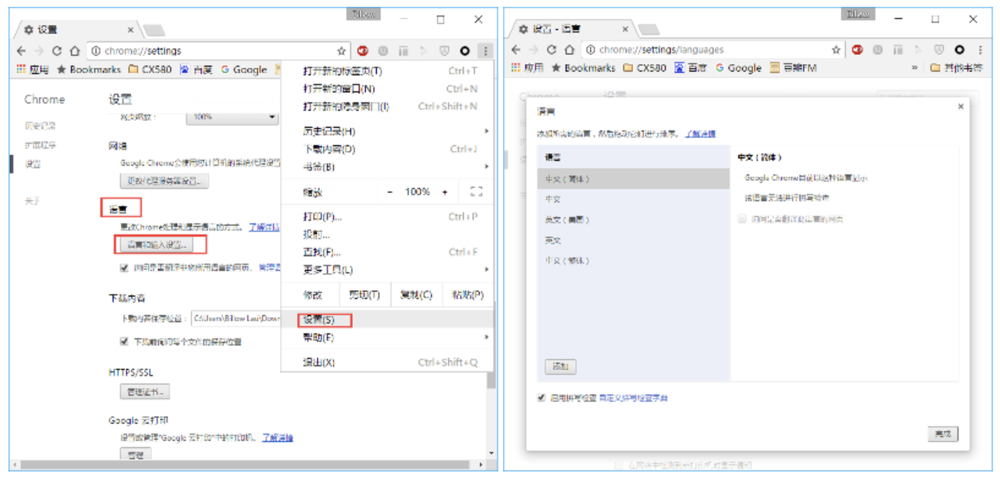

### 2) 系统设置
在jenkins主页进入系统设置

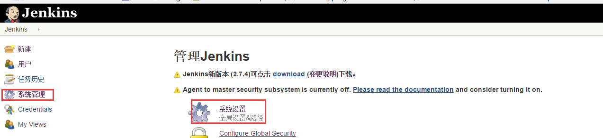

在Jenkins Location栏，根据jenkins所在服务器ip设置Jenkins URL，同时需配置一个管理员邮件地址，如果邮件地址未配置，后面配置的Jenkins发送邮件时会报错。

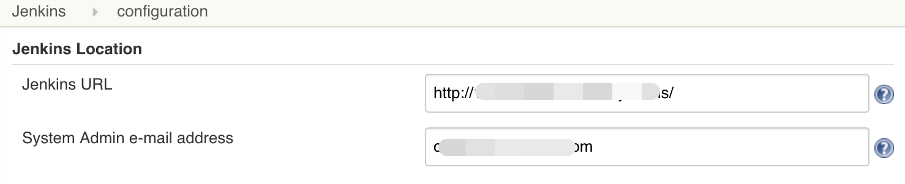

### 3) Configure Global Security
启用这项配置，可以指定用户角色

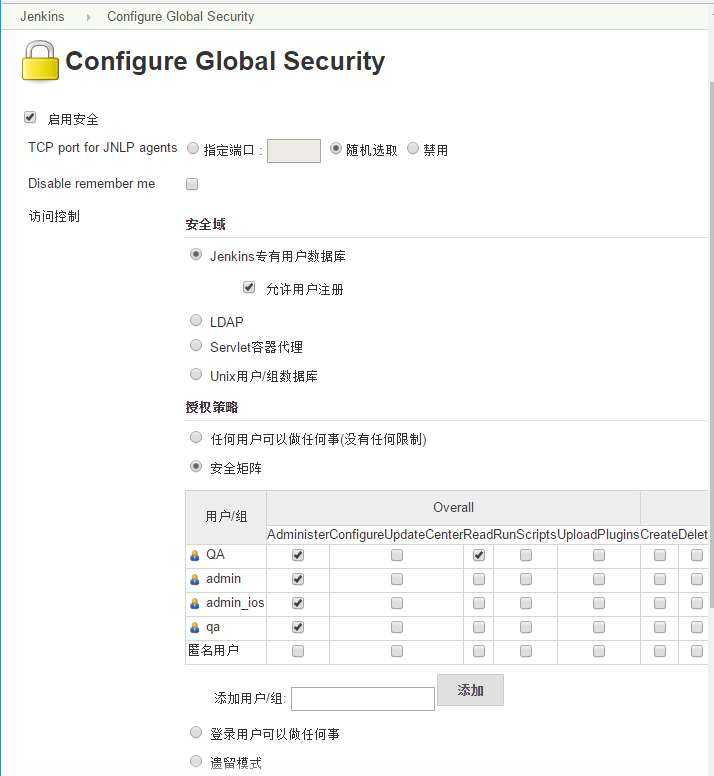

具体可以参考一下：<http://blog.csdn.net/achang21/article/details/48711583>

### 4) 插件管理
进入并切换到可选插件栏目，输入关键字搜索，勾选，并点击下方“直接安装”即可。<br>
由于Android使用的gradle构建，我们jenkins也需安装gradle插件，输入gradle搜索，找到“Gradle Plugin”安装；<p>
系统自带的邮件发送插件只能发给 固定的对象，且格式单一（txt），可选择安装Email Extersion Plugin，安装完后，切换到系统设置页面，会多一个Extended E-mail Notification栏目，在Extended E-mail Notification栏，指定邮件服务器配置、默认邮件后缀等信息

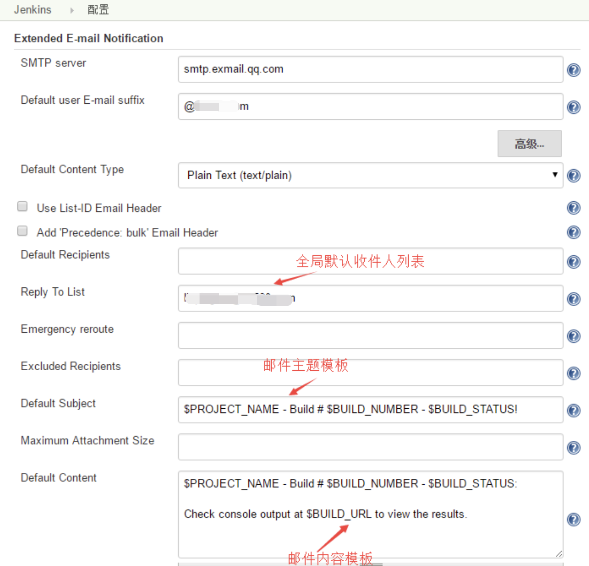

### 5) 新建和配置Job
在Jenkins主页，选择新建，输入名称，构建一个自由风格的软件项目。

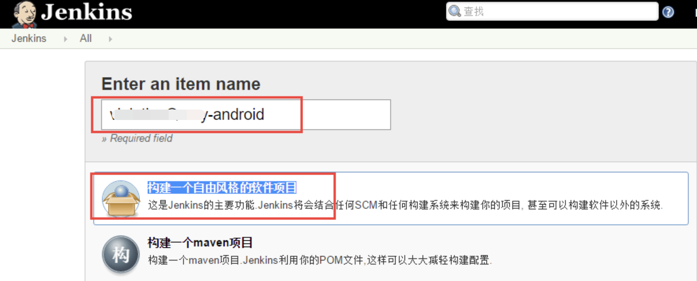

在“源码管理”栏目，选择一个版本管理软件，我们用的是svn，因此选择“Subversion”，在“Modules”中:<br>
Repository URL：填写项目svn的主目录<br>
Credentials：添加一个svn认证账户<br>
Local module directory：使用默认的当前目录<p>
依次点击“Add module...”添加所有项目依赖库，注意选择这里“Local module directory”相对目录结构。


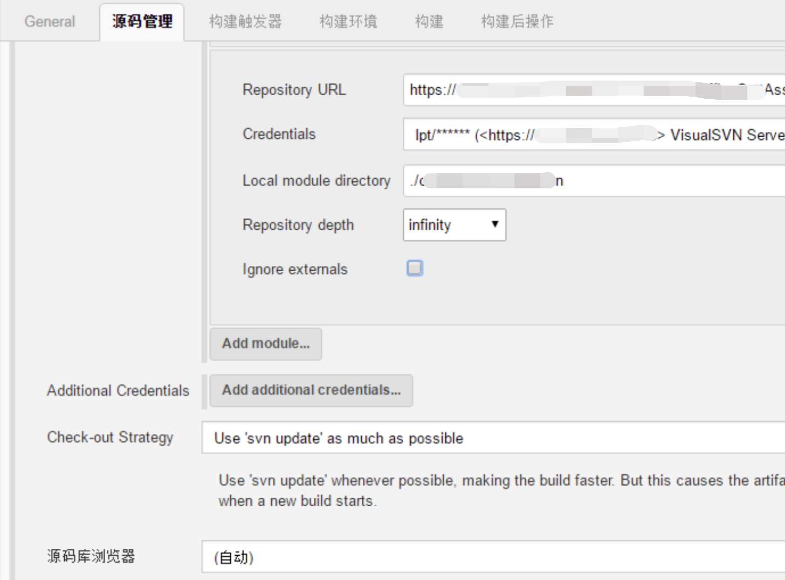

在“构建触发器”栏目，选择“Poll SCM”，并指定规则日程表，采用了著名的UNIX任务调度工具CRON所使用的配置方式，可以点击旁边的帮助获取语法说明。

下面的配置表示每天凌晨1点触发

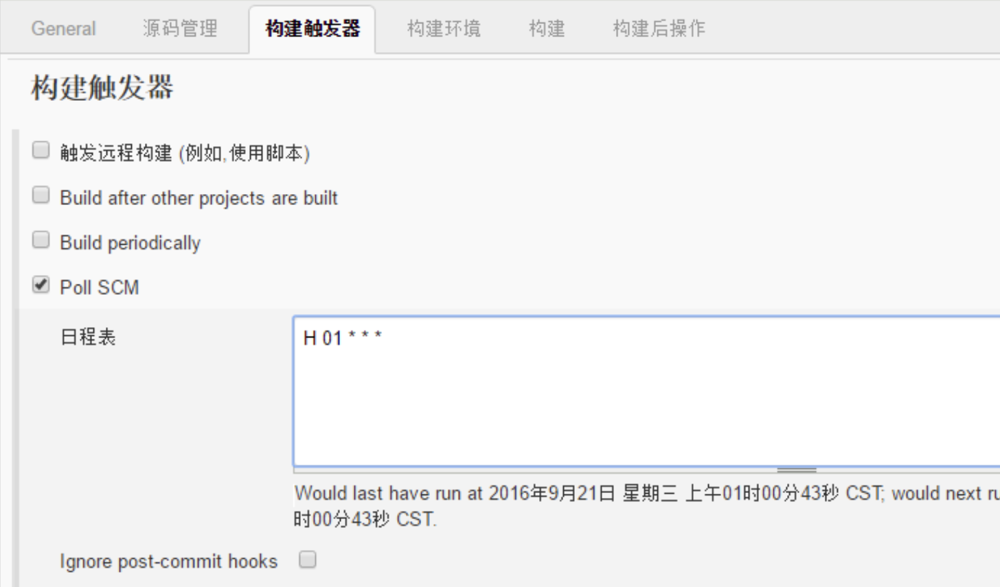

在“构建”栏目增加构建步骤，选择gradle，按下图选择gradle版本和需执行的gradle Task

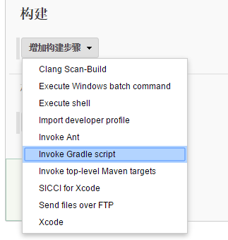
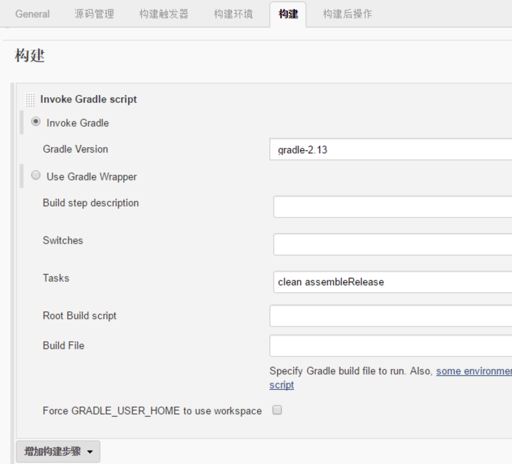

在“构建后操作”栏目添加一个操作，选择刚才安装的邮件通知插件下的“Editable Email Notification”，可以看到默认会添加全局邮件风格设置

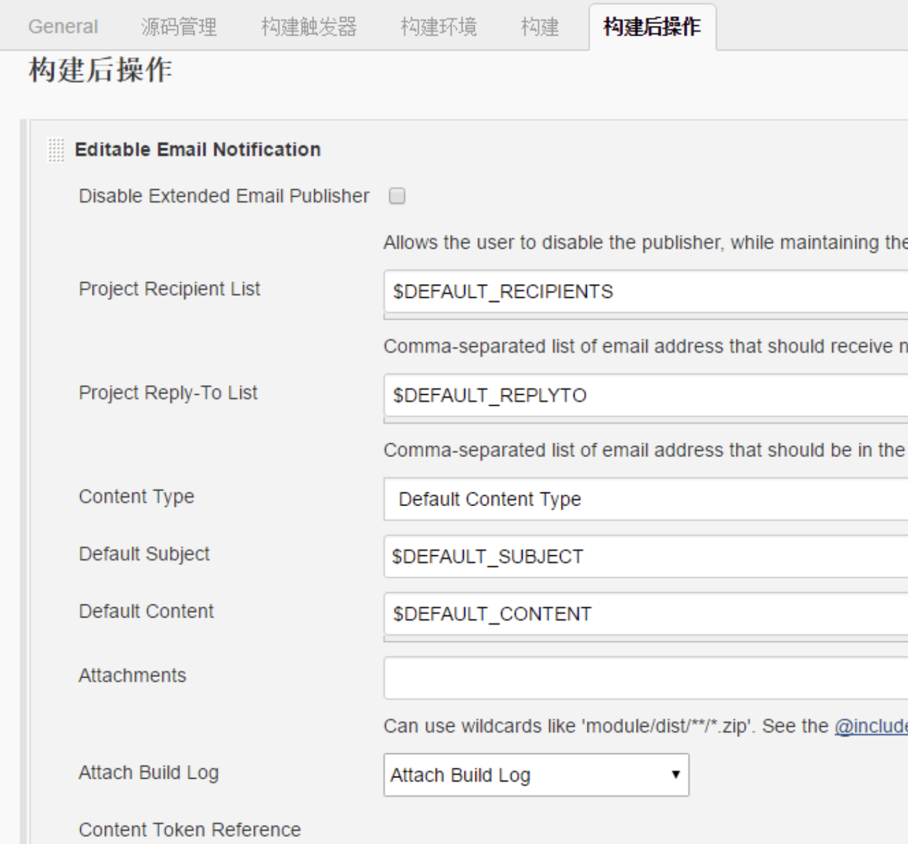

点击“Advanced Settings…”可以看到默认添加了一个构建失败时的通知触发器，这里可以再添加一些额外的收件人组，点击旁边的帮助可以了解各收件人组的定义。

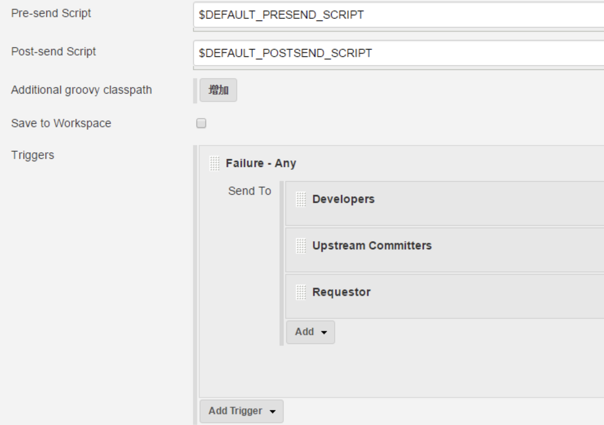

保存即可