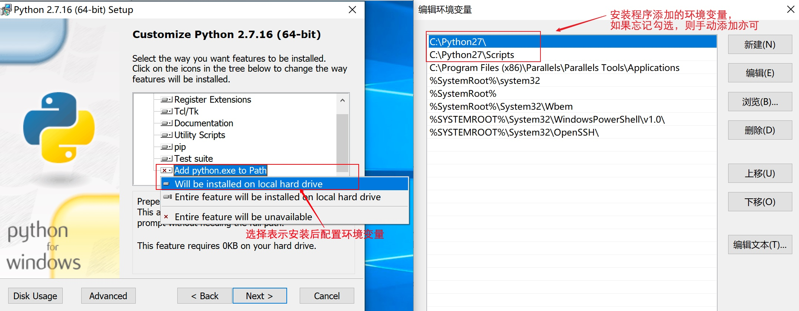
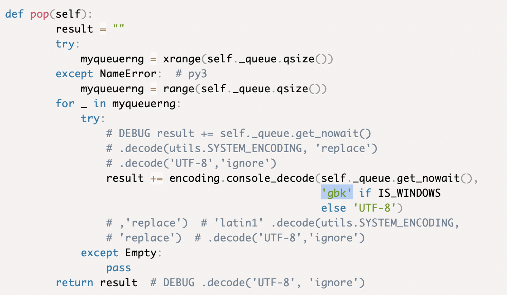
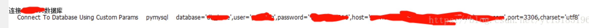

虽然目前Python3+Robot Framework+RIDE已经支持，考虑到团队其他成员仍然使用Python2，在此整理一份Python2+Robot Framework+RIDE搭建过程，备忘。<br>

<!--more-->

为什么使用pip安装？<br>
因为最简单，且规范

搭建一套基于Python2可以使用的Robot Framework开发运行环境，需要以下：<br>
1. Python 2.7<br>
2. pip 和 setuptools （Python 的套件管理程式，目前Python2版本已自带）<br>
3. Robot Framework （此工具本身）<br>
4. wxPython （Python 非常有名的一个GUI 库，支撑Ride的运行库）<br>
5. robotframework-ride （Robot Framework 测试数据的编辑器，它使测试用例的创建、运行、测试项目的组织可以在图形界面下完成）<br>
6. SeleniumLibrary （基于webdriver驱动，旧版叫Selenium2Library现已迁移到SeleniumLibrary，Selenium2Library仍可安装但事实上仍是引用SeleniumLibrary）<p>

# 环境搭建
## 1. 安装Python2
根据PC系统版本下载Python2安装包，选择最新版本的Python2即可（目前最新版本为：2.7.16）：<https://www.python.org/downloads/><br>
关于环境变量设置：安装过程中有一个选项添加环境变量，如果没有，请将“安装目录”和“安装目录\Scripts”添加到系统环境变量Path后面。



## 2. pip 和 setuptools
目前Python2版本已自带，将“安装目录\Scripts”添加到环境变量即可方便使用。<br>
初始内置pip并不一定最新，可以先按提示更新一下pip

```shell
python -m pip install --upgrade pip
```

## 3. 直接用pip安装ride
直接使用pip安装ride就可以了，Robot Framework、wxPython等依赖库都会自动安装好。

命令：

```shell
pip install robotframework-ride
```
```shell
PS C:\Users\peter> pip install robotframework-ride
DEPRECATION: Python 2.7 will reach the end of its life on January 1st, 2020. Please upgrade your Python as Python 2.7 won't be maintained after that date. A future version of pip will drop support for Python 2.7. More details about Python 2 support in pip, can be found at https://pip.pypa.io/en/latest/development/release-process/#python-2-support
Collecting robotframework-ride
  Downloading https://files.pythonhosted.org/packages/4e/a6/1835a17fa566b19c166735a9a75d55101e53b68566771ddb0b690dd4be83/robotframework_ride-1.7.3.1-py2.py3-none-any.whl (926kB)
     |████████████████████████████████| 931kB 133kB/s
Collecting Pygments (from robotframework-ride)
  Downloading https://files.pythonhosted.org/packages/5c/73/1dfa428150e3ccb0fa3e68db406e5be48698f2a979ccbcec795f28f44048/Pygments-2.4.2-py2.py3-none-any.whl (883kB)
     |████████████████████████████████| 890kB 60kB/s
Collecting robotframeworklexer (from robotframework-ride)
  Downloading https://files.pythonhosted.org/packages/9a/9f/a1fcd44548cbd78e52a31277c1c69a421c32186db9cdb5ccc2effec0e633/robotframeworklexer-1.1.tar.gz
Collecting wxPython (from robotframework-ride)
  Downloading https://files.pythonhosted.org/packages/70/a1/c51e4e6bcd3e6f0051bac2cf252e292f2bbf494e92977ec7df4ec253befb/wxPython-4.0.6-cp27-cp27m-win_amd64.whl (22.8MB)
     |████████████████████████████████| 22.8MB 100kB/s
Collecting Pypubsub (from robotframework-ride)
  Downloading https://files.pythonhosted.org/packages/95/5a/1801be1a63af9250e79b8941a37b88e3ca0d660b880b9862fe9016ae6a3a/PyPubSub-3.3.0.zip (87kB)
     |████████████████████████████████| 92kB 73kB/s
Collecting robotframework (from robotframework-ride)
  Using cached https://files.pythonhosted.org/packages/22/0f/1b9ffa0c4e59789b50e6034866e823b7d4a5c7eaedad7bfd0bba42f2aa9d/robotframework-3.1.2-py2.py3-none-any.whl
Collecting Pywin32 (from robotframework-ride)
  Downloading https://files.pythonhosted.org/packages/83/cc/2e39fa39b804f7b6e768a37657d75eb14cd917d1f43f376dad9f7c366ccf/pywin32-224-cp27-cp27m-win_amd64.whl (7.4MB)
     |████████████████████████████████| 7.4MB 69kB/s
Collecting numpy (from wxPython->robotframework-ride)
  Downloading https://files.pythonhosted.org/packages/48/83/203c397ecec78bdd618a0fb04a47482cfa2ae5ea2c6d428ed94258fe8671/numpy-1.16.5-cp27-cp27m-win_amd64.whl (11.9MB)
     |████████████████████████████████| 11.9MB 123kB/s
Collecting six (from wxPython->robotframework-ride)
  Downloading https://files.pythonhosted.org/packages/73/fb/00a976f728d0d1fecfe898238ce23f502a721c0ac0ecfedb80e0d88c64e9/six-1.12.0-py2.py3-none-any.whl
Collecting pillow (from wxPython->robotframework-ride)
  Downloading https://files.pythonhosted.org/packages/0e/81/158a63ff32ea444d4f858a9475da98a956ef5cd3011f677c6c5c8064efe5/Pillow-6.1.0-cp27-cp27m-win_amd64.whl (1.9MB)
     |████████████████████████████████| 1.9MB 62kB/s
Installing collected packages: Pygments, robotframeworklexer, numpy, six, pillow, wxPython, Pypubsub, robotframework, Pywin32, robotframework-ride
  Running setup.py install for robotframeworklexer ... done
  Running setup.py install for Pypubsub ... done
Successfully installed Pygments-2.4.2 Pypubsub-3.3.0 Pywin32-224 numpy-1.16.5 pillow-6.1.0 robotframework-3.1.2 robotframework-ride-1.7.3.1 robotframeworklexer-1.1 six-1.12.0 wxPython-4.0.6
```
## 4. 关于ride启动
完成安装后，在“安装目录\Scripts”下，会有ride.py，python执行它即可启动ride：

```shell
python ride.py
```
为方便日常启动，可在桌面新建一个ride.bat批处理文件来快速启动，内容：

```bat
python -c "from robotide import main; main()"
```
至此，整个环境安装完毕
## 5. 安装已有库并导入依赖库
以安装SeleniumLibrary为例，还是使用pip安装：

```shell
pip install robotframework-seleniumlibrary
```
安装完成后，即可在项目编辑页面进行添加，输入名字就可


为什么只要输入名字RIDE就能自动把库导进去？<br>
因为RIDE在输入的只是一个名字而不是路径时，就会到当前启动RIDE所用python的Lib/site-packages目录下寻找同名文件夹导入。

---
# 附：可能遇到的问题
### 1. 'ascii' codec can't encode characters in position 8-50: ordinal not in range(128)

Python在安装时，默认的编码是ascii，当程序中出现非ascii编码时，python的处理常常会报这样的错UnicodeDecodeError: 'ascii' codec can't decode byte 0x?? in position 1: ordinal not in range(128)，python没办法处理非ascii编码，此时需设置将python的默认编码改为目标编码，如utf8<br>
查询系统默认编码：

```python
sys.getdefaultencoding()  
```

设置默认编码<br>
python的Lib\site-packages文件夹下新建一个sitecustomize.py，内容为：

```python
# encoding=utf8
import sys
reload(sys)
sys.setdefaultencoding('utf8')
```

重启查询即可生效

### 2. 解决console乱码问题

修改python安装目录下以下文件<br>
[python安装目录]\Lib\site-packages\robotide\contrib\testrunner\testrunner.py<br>
修改pop方法，把if window前面的"latin1"编码改成gbk：

```python
def pop(self):
        result = ""
        try:
            myqueuerng = xrange(self._queue.qsize())
        except NameError:  # py3
            myqueuerng = range(self._queue.qsize())
        for _ in myqueuerng:
            try:
                # DEBUG result += self._queue.get_nowait()
                # .decode(utils.SYSTEM_ENCODING, 'replace')
                # .decode('UTF-8','ignore')
                result += encoding.console_decode(self._queue.get_nowait(),
                                                  'gbk' if IS_WINDOWS
                                                  else 'UTF-8')
                # ,'replace')  # 'latin1' .decode(utils.SYSTEM_ENCODING,
                # 'replace')  # .decode('UTF-8','ignore')
            except Empty:
                pass
        return result  # DEBUG .decode('UTF-8', 'ignore')
```



改完重启ride生效

### 3. 从数据库中取出中文乱码问题

数据库连接语句中加上charset='utf8'

