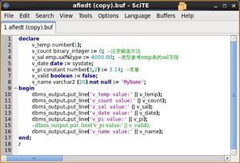

介绍、安装和配置SciTE

## 简介

SciTE是一款很好用的编辑器，支持众多的脚本，比如C、C++、PHP、C#、perl、html、css、java等等。免费而且开源。支持linux和win32环境。在windows下面只需要将下载的文件解压缩就能使用。较其它同重量级软件，最耀眼的就是导出功能，可以导出PDF/HTML/RTF/XML/LaTex类型的文件，直接就能将语法高亮的内容导出。

## 安装过程

1、下载源码：<http://www.scintilla.org/SciTEDownload.html>
下载linux版本，即时版本为Release 3.4.1。

2、用tar xzvf解压scite341.tgz，得到scite和scintilla两个文件夹。
进入任何一个文件夹，cat README可以看到此软件安装需gtk+ 2.0或以上、gcc 4.0或以上的依赖。

3、分别执行：

```shell
yum install gtk+*
yum install gcc*
```
解决依赖关系。

4、安装软件：
To build Scintilla, use the makefile located in the scintilla/gtk directory

```shell
cd scintilla/gtk
make
cd ../..
```
To build and install SciTE, use the makefile located in the scite/gtk directory

```shell
cd scite/gtk
make
make install
```

## 配置SciTE

1、配置中文界面
去官网下载语言配置文件：https://code.google.com/p/scite-files/wiki/Translations
选择Chinese，下载，并按照提示操作即可：
To use one of these translations, download the file, rename to "locale.properties" and move into the SciTE directory. Most recent version that changed locale.properties is 3.0.4.
将locale.properties放置在安装目录：

```shell
/usr/share/scite
```

2、配置参数
<http://www.linuxdiyf.com/viewarticle.php?id=314056>

3、在sqlplus中设置scite为默认编辑器
修改“/u01/app/oracle/product/11.2.0/db_1/sqlplus/admin/”下的alogin.sql即可（路径以具体oracle版本为准，这里是11g2版本），增加下面一行：

```shell
DEFINE_EDITOR="/usr/gscite/SciTE"
```
4、设置scite，使其能识别sqlplus的缓存文件（*.buf）<br>
因为*.buf是sql语法，所以可以直接修改sql.properties (路径："/user/share/scite/sql.properties")，找到下面这行：

```shell
file.patterns.sql=*.sql
```
修改为：

```shell
file.patterns.sql=*.sql;*.buf
```
保存即可。



